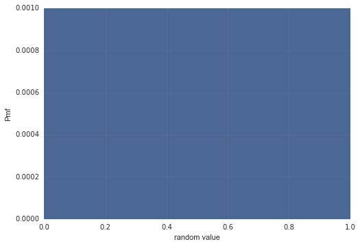
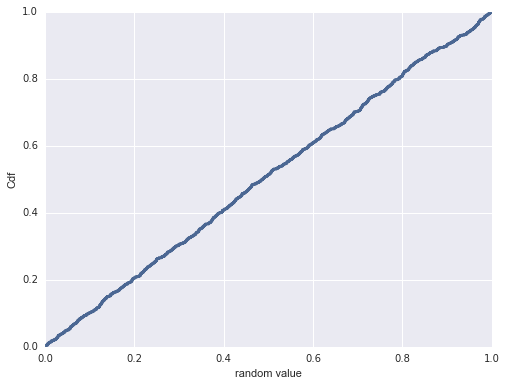

[Think Stats Chapter 4 Exercise 2](http://greenteapress.com/thinkstats2/html/thinkstats2005.html#toc41) (a random distribution)

>> ```python
import random
import thinkstats2
import thinkplot
>>
rand_nums = [random.random() for _ in xrange(1000)]
>>
# Pmf
rand_pmf = thinkstats2.Pmf(rand_nums)
thinkplot.Pmf(rand_pmf)
thinkplot.Show(xlabel='random value', ylabel='Pmf')
>>
# Cdf
rand_cdf = thinkstats2.Cdf(rand_nums)
thinkplot.Cdf(rand_cdf)
thinkplot.Show(xlabel='random value', ylabel='Cdf')
```



Yes the distribution is uniform because the cdf is approximately a straight line.
